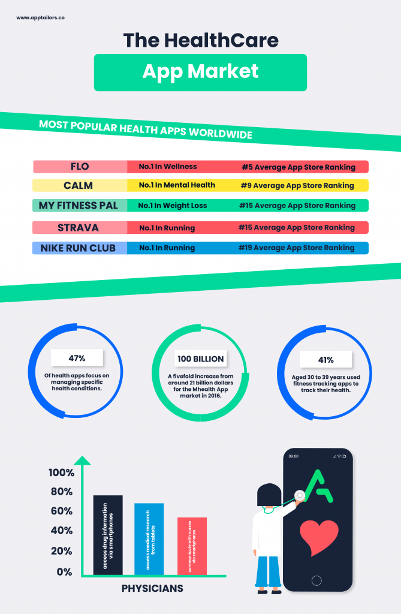

## **The Importance of Health Apps**

Mobile health apps are incredibly important in modern days. Without the help of
a nifty device in your hand, it can be difficult to have access to medical
information and stay on top of your body's health.

This can be in the form of functionalities such as monitoring your heart rate
similar to a medical device would, tracking blood pressure, and having access to
information to help manage various health conditions. All of this health
information can then be categorised efficiently in your app for you to access in
a click.

Not only is the mobile app market beaming with these applications for your
physical health, but there are also many mental health apps hitting app stores.
These are having a great positive impact on people across the world; by reducing
stress, coping with anxieties and contributing to helping people towards a
happier lifestyle

